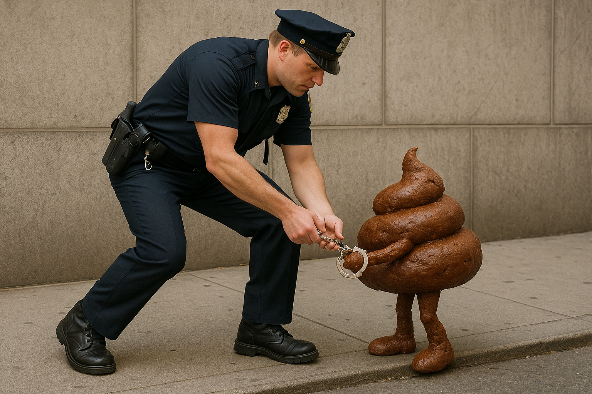

<html lang="es">
<head>
  <meta charset="UTF-8">
  <title>Antonio María Anselmi</title>
  
</head>
<body>

  <h1><strong>Antonio María Anselmi</strong></h1>
  

  
  
<em>Sello de aprobación</em>
 

  
<strong>Antonio Anselmi</strong> (conocido como Tony, Capea, Thomas Turbado; nacido en Padua el 22 de julio de 1992 - desaparecido en Madrid el 24 de mayo de 2025) es un célebre caso mediático tras su desaparición en Madrid el 24 de mayo de 2025.

  
Individuo de origen incierto entre el clero y el submundo futbolístico paduano, conocido por una carrera ecléctica que abarca desde el seminario hasta el torneo del palo, pasando por estudios universitarios prolongados y una cantidad no despreciable de episodios gastrointestinales documentados.

  

  

    <h2>Biografía</h2>

  <h3>Infancia y contexto familiar</h3>

<em>Foto de época de la sala donde tuvo lugar el feliz acontecimiento del nacimiento de Antonio; hoy transformada en lugar de peregrinación</em>

  
Antonio nace el 22 de julio de 1992 <small><i>(o eso dicen)</i></small> de padres ya curtidos, Betta y Vinicio, como el quinto de una prolífica camada. El nacimiento ocurre en un clima veraniego sofocante, plagado de mosquitos y poca inspiración por parte de los padres (que en este caso no brillaron). Desde temprana edad se distingue por su tendencia a huir, rebelarse y a lucir peinados cuestionables. Desde muy joven muestra inclinación por la travesura y una forma precoz de egocentrismo patológico.

   <h3>Formación religiosa y Seminario de Gozzano</h3>
    
Alrededor de los diez años, es encaminado hacia la carrera eclesiástica e inscrito en el Seminario de Gozzano. Aquí se destaca por su precoz vocación y ambición desmesurada, ganándose el apodo de "Monseñor" <small><i>(Maciel, M. (2006). Mi vida es Cristo. Editorial ART)</i></small>. Paralelamente desarrolla notables habilidades en el arte del peloteo institucional, descritas por fuentes contemporáneas como “extraordinariamente eficaz en la remoción de residuos fecales para sacrum osculum”. 

<em>El Monseñor durante una fervorosa invitación a la castidad prematrimonial; ya casi llega</em>

Durante el periodo seminarístico nace su tormentosa relación con Guillermo Meade, figura relevante en su formación espiritual y física. El camino emprendido en el alma según los dictados de la <i>espiritualidad de doble vía</i>, marcará profundamente el carácter del joven, abriéndolo a nuevas experiencias trascendentales. La relación, definida por varios analistas como <i>"intensa y multisensorial"</i>, implica prácticas diarias de subordinación voluntaria, entre ellas alimentar al maestro con claras de huevo y Weetabix, y recibir de este – según algunos testimonios – secreciones proteicas no bien identificadas.

  <h3>Adolescencia y formación informal</h3>
    
Antonio completa los estudios secundarios en el mismo instituto, destacándose por su marcada inclinación al lenguaje soez y la flatulencia. Entre los momentos significativos figura el traumático acercamiento al estudio de la mandolina, culminado en un accidente craneal, y su pasión por las matemáticas aplicadas al cuerpo humano, en particular a sus funciones evacuativas <small><i>(Anselmi A., Aproximaciones Newtonianas al Tiempo de Evacuación, 2010, Ediciones de la Calle)</i></small>.

Destaca su dieta a base de risotto con vinagre, responsable de una forma de diarrea crónica que afectó su metabolismo y limitó su desarrollo físico.

  
  
<em>Antonio durante una de sus Epifanías Estáticas obtenidas generalmente tras largas sesiones de frotamiento del Palo Santo</em>

De especial relevancia histórica es el episodio que marca su paso del conservadurismo militante a posiciones de centroizquierda eclesial. Durante una tarde de rutina en la biblioteca del seminario, Antonio escenifica una fuga teatral desde una ventana. Este episodio, conocido como “la defenestración de Pristina”, marca la ruptura simbólica con la obediencia ciega y el inicio de una fase de turbulencia ideológica.

  

    <h2>Estancia en el extranjero</h2>

   <h3>Período en España</h3>
    
Pasa un tiempo en Salamanca, del cual existen pocas fuentes. Sin embargo, es seguro que esta experiencia provocó el desarrollo de insomnio y numerosos traumas psicológicos, cuyos efectos aún son inciertos y objeto de estudio.

Los únicos testimonios escritos son:
- una nota en las crónicas oficiales, que indica simplemente: “Gran Bebedor.” Dado el poco alcohol permitido por las normas, los historiadores aún debaten cuál era el líquido en cuestión <small><i>(la historiografía se divide entre quienes sostienen que era fermento lácteo y quienes creen que era jugo de pepino)</i></small>.
- un documento médico redactado tras un test psicológico. Dicho documento señala un diagnóstico de *Trastorno de Estrés Post-Convento (TEPC)* <small><i>(lo leyó Andreone en algún lugar)</i></small>. Entre los síntomas se incluyen: necesidad crónica de atención, comportamiento histriónico, accidentes autolesivos, y excesiva implicación emocional en contextos futbolísticos de tercera categoría <small><i>(especialmente el PALO, n. del e.)</i></small>.

  

    <h2>Regreso a Padua</h2>

    <h3>Carrera deportiva</h3>
    
Anselmi ha militado en varios equipos de fútbol sala y fútbol 7, con fortuna dispar. Es conocido sobre todo por su implicación en los *Lemme Lemme*, formación familiar creada para el célebre Torneo del Palo. Aunque odiados por buena parte del público y rivales, los Lemme Lemme se han destacado por su longevidad, cohesión y sorprendentes victorias.

  
<em>Finalista del torneo del palo 2015, quizás el año más "duro" de su carrera</em>

Su carrera deportiva está marcada por numerosas lesiones, que sin embargo no le han apartado de la frecuente asistencia a vestuarios masculinos ni de una curiosa tendencia a comentar las dotaciones anatómicas ajenas.

  

    <h2>Estudios universitarios</h2>
    
Tras volver a Padua, Anselmi se inscribe en Ciencias Políticas. Al principio se declara soltero convencido, pero rápidamente inicia una relación sentimental que lo lleva a un largo periodo de “reclusión afectiva”. En este periodo mantiene las actividades futbolísticas y académicas, aunque con un ritmo universitario más cercano a la Cuaresma que a la convocatoria de junio.

  
  
<em>El Guepardo en su punto álgido de seducción</em>

Es conocido por haber sido un asiduo frecuentador de salas de estudio, usándolas más como terrenos de caza que como lugares de instrucción, merodeando entre los bancos como un guepardo hormonal en busca de una abundancia ortopédica sobre la cual lanzarse; exibiendo lo máximo de sus capacidades seductoras, empezando así una nueva etapa biográfica.

    
  

  

    <h2>Il caso mediatico</h2>

  <h2>Arresto e scomparsa</h2>

  
  
<em>Ultima foto esistente di Antonio durante l'arresto, da questo momento in poi le sue tracce si perdono nei marasmi della burocrazia giudiziaria</em>

Durante una gita con amici a Madrid, il 24 maggio 2025, per ragioni ancora da chiarire, Antonio è stato arrestato e condotto in carcere <small><i>(secondo El País, l'arresto sarebbe avvenuto durante una rissa a base di karaoke e sangria)</i></small>. Nonostante le testimonianze dei compagni, la polizia spagnola nega tale avvenimento, risultando a tutt'oggi ufficialmente scomparso. Le fiacche e poco insistenti lamentele dei compagni non sono state sufficienti a fare chiarezza sul caso <small><i>(secondo certi l'inefficacia delle rimostranze fu dovuta al fatto che furono trascritte su carta igienica e inviate via corriere low-cost)</i></small>.

   
  

    <h2>Ideologia e affiliazioni</h2>
    
Antonio si dichiara moderato (Partito Carismatico dei Moderati Incerti), ma manifesta tendenze democristiane di fondo, con tratti di ambiguità politica e spirituale. La sua adesione a strutture comunitarie è intensa ma ciclica, e la sua capacità di assumere ruoli di potere è direttamente proporzionale alla possibilità di farsi notare.

  

  

    <h2>Eredità e interpretazioni</h2>
    
Alla sua scomparsa, Antonio lascia una vasta mole di materiali scadenti, un paio di scarpe ancora calde e un profilo Facebook attivo. La sua figura è oggetto di dibattito tra studiosi di psicopatologia, tifosi del Palo e sessuologi gesuiti.

Viene commemorato ogni anno con la "Notte del Pristina", un rito collettivo che prevede il canto ad alta voce delle sue opere più note (La Diagnosi, La mia sparizione in Olanda, Jefferson) e una danza rituale attorno a una padella di risotto all’aceto.

  

  

    <h2>Dibattiti storiografici</h2>
    <ul>
      <li>Il numero esatto di eiaculazioni del Meade ingerite da Anselmi è oggetto di dibattito accademico.</li>
      <li>Secondo alcune fonti, il colpo in testa ricevuto dal mandolino sarebbe stata in realtà un tentativo di autodifesa da parte del mandolino vittima di gesti poco pudichi indesiderati.</li>
      <li>Il risotto all’aceto è stato candidato come patrimonio immateriale della tragicommedia educativa piemontese.</li>
      <li>Lo storico della Legione di Cristo, David Murray nel suo saggio "Un racconto di uso e abuso" insiste nel suggerire che la sua altezza limitata sia stata indotta volontariamente per rendere più agevole lo svolgimento della sua funzione di inalatore di etere posteriore.</li>
    </ul>
  

